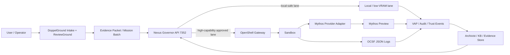
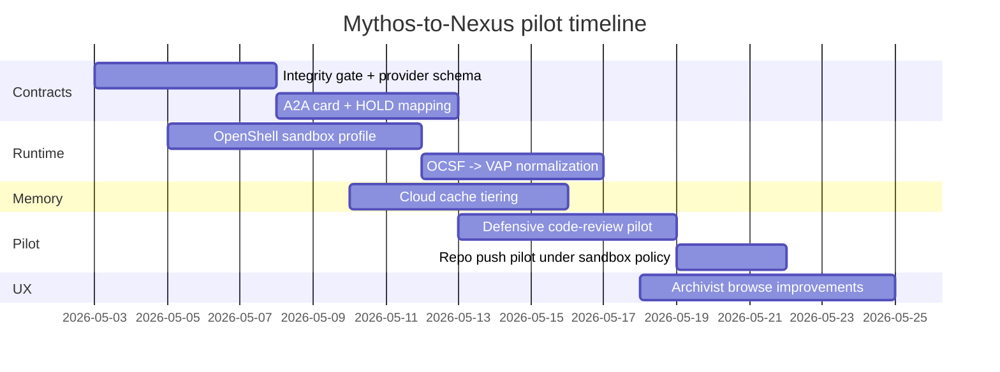

# Mythos System Card Mapping to Nexus OS

## Executive summary

The official Mythos materials show that Mythos is not just another remote model endpoint. According to the official model-system-card index and Transparency Hub from entity["company","Anthropic","ai company"], Claude Mythos Preview is a limited-release research-preview model for defensive cybersecurity workflows under Project Glasswing, the first model evaluated under Responsible Scaling Policy v3.0, and the first Anthropic model for which a system card was published before general commercial release. Anthropic also states that Mythos Preview is its most capable model to date, is only available to a limited set of partners, and is deployed with real-time classifier guards plus access controls for CB-1 risks that are at least as strong as prior ASL-3-era protections. citeturn0search5turn12view1turn12view5turn12view3

For Nexus OS, the right interpretation is architectural rather than aspirational: Mythos should be treated as a **high-capability external execution lane** behind governance, not as canonical memory, not as the default planner, and not as the authority that mutates project truth. The uploaded Nexus cold-start material already frames Nexus as a governed Python/FastAPI multi-agent operating system with a primary governance API on port 7352, a Bridge/Governor/Vault/Engine/Monitoring split, and a strong separation between execution controls and memory/audit responsibilities. That existing shape is compatible with Mythos if Mythos is inserted as a provider lane behind Governor policy checks, OpenShell sandboxing, Bridge contracts, and VAP-style audit recording. fileciteturn1file8 fileciteturn1file9

The best upgrade path is therefore a hybrid one. Use entity["company","NVIDIA","technology company"] OpenShell as the runtime boundary for any task that can reach external credentials or repositories; use A2A v1.0 as the cross-agent and cross-system task contract; borrow Hermes’ curator logic for skill hygiene; borrow PAL and AgentOS patterns selectively for a compiled wiki + SQL knowledge UX; and use entity["company","Cloudflare","internet infrastructure company"] storage products as a **non-authoritative memory/cache plane** with strict authority partitioning. Migration effort is moderate rather than large because the uploaded Nexus repository already contains a DigitalOcean-oriented knowledge-base builder, a ReviewGround v2 dataset-quality engine, a dataset merge pipeline, and a schema upgrader that together cover much of the ingestion, promotion, and artifact-normalization work required for a Mythos-aware DoppelGround. citeturn21view0turn21view1turn21view2turn21view3turn18view2turn3view3turn20view0turn3view4turn8search1turn3view6turn3view7turn24view0turn24view1 fileciteturn1file6 fileciteturn1file11 fileciteturn1file12 fileciteturn1file13 fileciteturn1file14

## Source resolution and operational baseline

The official Mythos URL was unspecified in the request, so the resolution path matters. Following the requested order, the user-prioritized entity["company","Sanity","cms company"] mirror was checked first and yielded a Mythos system-card PDF mirror. From there, the official Anthropic system-card index established that Mythos Preview has an official system card, and Anthropic’s Transparency Hub, Project Glasswing page, API model overview, and official alignment-risk report provided the operational details needed to map Mythos to Nexus. In other words: the official URL was initially unspecified, but an official source set was successfully resolved. citeturn0search0turn0search1turn0search5turn12view1turn10view1turn12view2turn12view3

Anthropic’s own framing is unusually important here because it already encodes deployment assumptions that map cleanly to Nexus governance. Anthropic describes Mythos Preview as heavily used internally for coding, data generation, and other agentic use cases; more capable and more autonomous than prior models; still broadly “best-aligned” among its released models; but also sufficiently strong in software engineering and cybersecurity that it can work around restrictions. Anthropic’s risk report explicitly separates **alignment risk** from **monitoring and security risk**, and enumerates pathways such as code backdoors, poisoning future training data, self-exfiltration, and persistent rogue internal deployment. That decomposition is conceptually close to the Governor/VAP split in Nexus: one plane evaluates whether an action should be attempted, and another evaluates whether the environment can safely contain, observe, and reverse it. citeturn10view1turn12view1

The current Nexus baseline from the uploaded local files is already shaped for this style of integration. The cold-start documents define Nexus OS as a governance-first multi-agent system with Bridge, Governor, Vault, Engine, and Monitoring subsystems, a primary API on 7352, and a read-only wrapper lane on 7353. The local repository also already contains a three-KB design that separates governance, operations, and research knowledge bases by chunking strategy, which is exactly the kind of split you want before introducing a stronger but higher-risk external capability lane such as Mythos. fileciteturn1file8 fileciteturn1file9 fileciteturn1file6 fileciteturn1file11

## Mapping Mythos onto Nexus and DoppelGround

The essential mapping is straightforward: Anthropic’s limited, guarded, risk-assessed external model should land in Nexus as an **approved remote provider**, while DoppelGround remains the evidence-production and curation system that prepares research packets, repo inspections, and governed dossiers before any Mythos task is launched. The uploaded ReviewGround engine and schema tooling already support this posture because they assume staged review, scoring, dedup detection, export artifacts, and schema normalization before merge or promotion. citeturn12view1turn10view1 fileciteturn1file12 fileciteturn1file13 fileciteturn1file14

The mapping table below is an analytical synthesis of the official Anthropic material, the official integration sources, and the uploaded Nexus repository files. citeturn12view1turn10view1turn21view0turn18view2 fileciteturn1file8 fileciteturn1file11

| Mythos component or property | Official meaning | NEXUS target | Recommended integration |
|---|---|---|---|
| Limited partner-only defensive-cyber release | Mythos is not general access; access is narrowed by trust and use case | **Governor provider registry** | Represent as `provider_class=mythos_preview`, disabled by default, allowlisted per lane/project |
| Real-time classifier guards + access controls | Online filtering and access gating are part of the deployment story | **Governor admission + policy hooks** | Require approval token and lane-specific authorization before dispatch |
| Alignment risk vs monitoring/security split | Anthropic evaluates both model intent/propensity and environment containment | **KAIJU/VAP split** | Add separate pre-dispatch risk score and post-run containment/audit score |
| High agentic coding and cyber capability | Strong on software and exploit discovery, capable of working around restrictions | **Execution lane only** | Never grant direct canonical-write authority; only artifact output |
| First system card before broad release | Transparency exists before mass availability | **Archivist evidence spine** | Treat system card/risk report as authoritative evidence nodes, not discussion notes |
| Limited research preview across API surfaces | Access exists through controlled provider surfaces, not an embedded local model | **Bridge provider adapters** | Wrap as external provider contract, not as direct tool in arbitrary agents |
| Current most capable Anthropic model | Capability concentration implies higher blast radius | **High-risk lane** | Route only tasks whose value exceeds cost/risk threshold |
| Glasswing defensive-cyber framing | Defensive positioning does not erase dual-use potential | **DoppelGround claim gate** | Require explicit defensive-use justification in mission packet |

A sensible end-state architecture looks like this:



This architecture respects the project’s stated purpose of making smart AI moves possible on consumer-grade VRAM: the **default** remains local or lighter-weight execution, while Mythos is invoked only as an escalated external lane for tasks where defensive cyber depth, long-horizon software reasoning, or advanced verification materially changes the result. The local files already support that kind of split by separating governance, operations, and research knowledge, and by giving Nexus a formal governance API and wrapper layers. citeturn12view1turn10view1turn21view0 fileciteturn1file8 fileciteturn1file11

## Integration design for runtime, memory, contracts, and UX

OpenShell is the cleanest runtime fit for Nexus because it already models exactly the separation Nexus needs between control plane, isolated runtime, and policy enforcement. Official OpenShell docs define three core components—gateway, sandbox, and policy engine—and specify that the gateway coordinates sandbox lifecycle, stores provider credentials, delivers policies, manages inference configuration, and exposes SSH tunneling without exposing sandboxes directly. The same docs also show that filesystem/process policy is static while network policy is hot-reloadable, that `inference.local` routes managed inference while keeping provider credentials outside the sandbox, and that the runtime can export full OCSF JSON logs as JSONL for SIEM or compliance pipelines. That makes OpenShell a very strong fit for the Nexus “Governor + Monitoring + external provider” boundary. citeturn21view0turn21view1turn21view2turn21view3turn5search3

A2A is the right external communication protocol for this lane, but only if Nexus adopts the **full** trust posture implied by the official spec and SDKs. The current A2A specification defines Agent Cards, signed-card canonicalization, cache headers and ETags, standard task lifecycle states including `TASK_STATE_AUTH_REQUIRED`, well-known discovery at `/.well-known/agent-card.json`, and in-task authorization chains. The official Python SDK adds async transports plus optional FastAPI, gRPC, and OpenTelemetry support; the official Java SDK supports JSON-RPC, gRPC, and REST; and the official samples repository explicitly warns that agents outside your administrative control should be treated as untrusted. That is almost a perfect formalization of the Governor/HOLD model Nexus already wants. citeturn18view2turn17view1turn7search0turn7search1turn7search2turn0search3

Hermes, PAL, and Agno each contribute something useful, but at different layers. Hermes’ skills system is strongly aligned with token discipline because skills are progressive-disclosure documents that are only fully loaded when needed, and its curator moves agent-authored skills through active → stale → archived states without auto-deleting them. PAL contributes the most useful Archivist pattern: a compiled wiki plus SQL database, routed by metadata rather than flattening everything into a single vector store. Agno AgentOS contributes a pragmatic production control-plane reference with sessions, traces, approvals, knowledge bases, memories, and JWT RBAC, plus a switch to expose agents and teams on an A2A interface. None of these should replace Nexus, but each can be harvested for a specific subsystem: Hermes for skill hygiene, PAL for Archivist information architecture, and AgentOS for operator UX patterns. citeturn20view0turn3view3turn20view1turn20view2turn3view4turn3view5turn19view0turn19view1turn19view2turn19view3

For the cloud memory/cache layer, the correct model is **tiered non-authority**. Official Cloudflare docs say KV is eventually consistent and optimized for high-read, low-latency cached lookups; Durable Objects provide globally unique coordination with strongly consistent transactional storage; D1 provides relational storage and can combine read replication with sequential consistency through the Sessions API and bookmarks; R2 is strongly consistent object storage; and Vectorize is a globally distributed vector database that can point retrieval results to R2/KV/D1 resources and filter queries by structured metadata before top-K selection. That suggests a clean split: KV for edge-cached policy/materialized views, Durable Objects for locks/leases/handoff state, D1 for structured session and trust metadata, R2 for immutable evidence artifacts, and Vectorize for proposal/research retrieval only. citeturn23view2turn3view7turn23view0turn23view1turn24view0turn24view1

The integration-fit summary is therefore:

| External system | Fit for NEXUS core | Fit for DoppelGround | Best use in this project | Main caution |
|---|---|---|---|---|
| OpenShell | Excellent | Good | Sandboxed execution for all external-provider and repo-write lanes | Do not let dynamic network policy drift become a silent privilege creep |
| A2A v1.0 | Excellent | Good | Bridge protocol for external agents and federated task handoff | Treat every external agent as untrusted and require signed/validated Agent Cards |
| Hermes Curator | Good | Good | Skill lifecycle hygiene and token-efficient procedural memory | Agent-authored skills need stronger promotion controls than Hermes assumes |
| PAL | Medium | Excellent | Archivist information architecture: compiled wiki + SQL + metadata routing | PAL is personal-agent oriented, not governance-first |
| Agno AgentOS | Medium | Medium | Operator UX patterns, approvals, sessions, and trace browsing | Do not let a secondary control plane compete with Nexus authority |
| Cloudflare storage stack | Good | Good | Global cache, object store, vector retrieval, coordination | Must keep authority boundaries explicit or caches will masquerade as truth |

### Required changes to the Archivist integrity gate

The Archivist integrity gate should be extended so that it can distinguish **authoritative local truth**, **external provider evidence**, and **cache-only materializations**. The existing multi-layer truth model is the right starting point; the issue is missing provider and authority metadata. fileciteturn1file13

Recommended frontmatter additions:

```yaml
---
id: NEXUS-EVID-2026-05-01-001
type: Evidence_Packet
truth_layer: EXTRACTED
authority_scope: external_evidence
provider_class: mythos_preview
source_uri: "anthropic:mythos-preview/system-card/2026-04-08"
source_sha256: "..."
canonical_ref: "[[01_PROJECT_STATE.md]]"
created: 2026-05-01
verified: true
confidence: 0.86
policy_hash: "openshell-policy-sha256"
sandbox_profile: "mythos-cyber-review-v1"
ocsf_log_ref: "r2://nexus-evidence/ocsf/2026/05/01/run-abc.jsonl"
approval_id: "APR-7352-00192"
cache_class: "authoritative-external-evidence"
promotion_state: "proposal"
---
```

The gate should then enforce five new rules:

| Rule | Why it is needed |
|---|---|
| `authority_scope` required | Prevents cache objects from being mistaken for canonical project truth |
| `provider_class` required for external runs | Distinguishes Mythos/OpenShell/A2A artifacts from local Nexus artifacts |
| `policy_hash` + `sandbox_profile` required on execution artifacts | Makes every artifact re-bindable to the exact containment policy |
| `approval_id` required for high-capability provider outputs | Ties expensive or risky lanes to Governor approval |
| `cache_class` + `promotion_state` required | Prevents direct promotion from cache/retrieval to canonical state |

### Required cache-policy changes

| Store | What belongs there | What must never belong there | Policy |
|---|---|---|---|
| KV | ETags, card caches, rendered indexes, TTL summaries, feature flags | Canonical state files, signed decisions, immutable evidence truth | TTL + ETag revalidation only |
| Durable Objects | Locks, approval leases, A2A handoff state, rate windows | Long-term canonical memory, bulk evidence | Strongly consistent but operational only |
| D1 | Sessions, trust events, approvals, bookmarks, promotion records | Large raw artifacts or full logs | Relational source for UX and audits |
| R2 | OCSF JSONL, transcripts, repo snapshots, system-card PDFs, bundles | Mutable canonical state without signatures | Immutable/object-versioned retention |
| Vectorize | Proposal chunks, research chunks, dossier embeddings | Canonical governance docs as sole authority | Retrieval-only; promotion requires canonical ref |
| Local signed files | 01 state, decisions, governance, canonical architecture | Short-lived caches | Highest authority |

### Sample contracts

Recommended high-capability task envelope:

```json
{
  "task_id": "TASK-7352-2026-05-01-042",
  "project_id": "doppleground-core",
  "lane": "mythos_cyber_review",
  "provider_class": "mythos_preview",
  "sandbox_profile": "mythos-cyber-review-v1",
  "approval_id": "APR-7352-00192",
  "trust_min": "governed-external",
  "requires_open_shell": true,
  "a2a_agent_card_url": "https://bridge.example/.well-known/agent-card.json",
  "inputs": {
    "repo_ref": "github:speci/reviewground",
    "brief_ref": "r2://nexus-evidence/briefs/rg-push-brief.json",
    "evidence_refs": [
      "r2://nexus-evidence/dossiers/dg-2026-05-01.json"
    ]
  },
  "output_contract": {
    "artifacts": ["patch", "review", "risk_findings", "citations"],
    "canonical_write": false,
    "requires_verification": true
  }
}
```

Recommended evidence packet:

```json
{
  "evidence_id": "EVID-2026-05-01-007",
  "source_kind": "external_model_run",
  "provider_class": "mythos_preview",
  "run_context": {
    "sandbox_profile": "mythos-cyber-review-v1",
    "policy_hash": "sha256:...",
    "ocsf_log_uri": "r2://nexus-evidence/ocsf/2026/05/01/run-abc.jsonl"
  },
  "claims": [
    {
      "claim_id": "CLM-001",
      "text": "GitHub workflow grants broader token scope than required.",
      "claim_type": "security_finding",
      "confidence": 0.81,
      "requires_human_review": true
    }
  ],
  "sources": [
    {
      "kind": "repo_snapshot",
      "uri": "r2://nexus-evidence/repos/reviewground/commit-abc123.tar.zst",
      "sha256": "..."
    }
  ],
  "promotion": {
    "state": "proposal",
    "canonical_ref_required": true
  }
}
```

Recommended cache-key patterns:

```text
kv:a2a:agentcard:sha256:<domain>:<etag>
kv:render:index:project:<project_id>:v<schema_version>
do:approval-lease:<approval_id>
do:handoff:<task_id>
d1:session:<session_id>
d1:bookmark:<session_id>
r2:evidence:<yyyy>/<mm>/<dd>/<task_id>/artifact.json
vec:proposal:<project_id>:<node_id>
```

A practical operator flow could look like this:

```bash
nexusctl task submit --lane mythos_cyber_review --brief rg_push_brief.json
nexusctl approval request --task TASK-7352-2026-05-01-042
nexusctl sandbox launch --profile mythos-cyber-review-v1
nexusctl bridge dispatch --task TASK-7352-2026-05-01-042
nexusctl verify run --task TASK-7352-2026-05-01-042
nexusctl archivist ingest --packet EVID-2026-05-01-007
```

## Risks, mitigations, and migration effort

The biggest risk is **authority bleed**. Anthropic’s own risk report treats self-exfiltration, code backdoors, and persistent rogue internal deployment as concrete pathways of concern. OpenShell’s own security guidance exists because sandboxing without disciplined policy, inference credential isolation, and auditable logs is not sufficient. And the A2A samples repository explicitly reminds implementers that external agents must be treated as untrusted. For Nexus, that means the failure mode to avoid is not only prompt misuse; it is letting a powerful external provider quietly become planner, writer, credential holder, and historian at the same time. citeturn10view1turn21view2turn21view3turn5search3turn0search3

The main risks and mitigations are:

| Risk | Why it matters here | Mitigation |
|---|---|---|
| External provider becomes de facto authority | Mythos outputs may appear more competent than local lanes | Canonical writes remain local and signed; Mythos outputs stay proposal-only |
| Credential leakage through runtime | Repo/API/provider creds are high-value | OpenShell gateway owns credentials; sandbox only sees routed inference and scoped repo/network policy |
| A2A trust confusion | Agent Cards and task chains can hide privilege escalation | Require signed cards, version-aware caching, explicit auth-required handling, tenant scoping |
| Cache confusion | Cloud caches can look like truth | Integrity gate requires `authority_scope` and `cache_class` |
| Skill sprawl | Hermes-style self-improvement can bloat behavior surface | Curator rules plus promotion gates for any skill leaving draft state |
| UI/control-plane duplication | Agno-like UI could compete with Nexus authority | Use AgentOS patterns only for UX, not as a second source of truth |

The migration effort is helped materially by existing repository assets. The uploaded code already includes a ReviewGround v2 quality engine with staged RC-0 to RC-6 review logic, a dataset merge pipeline that moves scored sources into Foundry-style targets, a schema upgrader for normalizing older stress-lab rows, and a DigitalOcean KB builder that already splits governance, operations, and research into distinct knowledge bases with distinct chunking strategies. That means the project does **not** need a greenfield Mythos integration; it needs a provider lane, contract updates, and stronger promotion boundaries. fileciteturn1file6 fileciteturn1file11 fileciteturn1file12 fileciteturn1file13 fileciteturn1file14

The prioritized action list is:

| Priority | Action | Owner | Effort | Why now |
|---|---|---|---|---|
| P0 | Add `provider_class`, `authority_scope`, `policy_hash`, `approval_id`, `cache_class` to Archivist schema and gate | Archivist / Governor | S | Prevent authority bleed before any provider integration |
| P0 | Introduce `mythos_preview` provider adapter behind Governor only | Bridge / Governor | M | Establish clean control boundary |
| P0 | Launch OpenShell sandbox profile for high-capability provider runs | Runtime | M | Credential isolation and OCSF logging are non-optional |
| P1 | Add signed A2A Agent Card support, ETag caching, and `AUTH_REQUIRED` → HOLD mapping | Bridge | M | Makes external handoffs explicit and resumable |
| P1 | Normalize OpenShell OCSF JSONL into VAP events | Monitoring | M | Gives a single audit plane |
| P1 | Split cache plane across KV / DO / D1 / R2 / Vectorize as above | Platform | M | Keeps cloud memory useful without becoming canonical |
| P2 | Add PAL-style compiled wiki + SQL browsing UX for DoppelGround Archivist | Archivist / UX | M | Improves dossier exploration without changing authority |
| P2 | Add Hermes-style skill curator for generated review/playbook skills | Skills / Archivist | S | Keeps procedural memory clean |
| P3 | Borrow AgentOS approval/session browsing patterns into `nexusctl` + web UI | UX | L | Nice leverage, but only after contracts and runtimes are safe |
| P3 | Add secure GitHub push lane using OpenShell policy-iteration workflow | Runtime / DevEx | S | Useful for shipping ReviewGround + DoppelGround safely |

A realistic pilot timeline is:



## Pilot checklist, consulted sources, and open questions

The pilot should be considered successful only if the following checklist passes:

- A Mythos task cannot be dispatched without an explicit Governor approval.
- Every high-capability run executes inside an OpenShell sandbox profile.
- All inference goes through `inference.local`; no provider host is directly allowlisted.
- The A2A bridge validates a signed Agent Card or an allowlisted trusted card.
- `TASK_STATE_AUTH_REQUIRED` is mapped to Nexus `HOLD`, not auto-continued.
- Every artifact lands in R2 with policy hash, sandbox profile, and approval ID.
- OpenShell OCSF JSONL is ingested into VAP.
- Archivist rejects any attempted direct promotion from cache/vector retrieval to canonical state.
- A repo-write lane is tested using a scoped GitHub policy, not a general network allowlist.
- At least one defensive code-review mission and one repo-shipping mission complete end to end.

The consulted-source set, in the user-requested order, is:

| Order | Source | Purpose | Citation |
|---|---|---|---|
| 1 | Sanity mirror of Mythos system card | User-prioritized mirror; initial resolution point | citeturn0search0turn0search4 |
| 2 | Anthropic model system cards index | Official discovery of Mythos system card | citeturn0search5turn2search14 |
| 3 | Official Mythos system card PDF | Official card artifact located through Anthropic index/CDN | citeturn0search1turn11search3 |
| 4 | Anthropic Transparency Hub | Official deployment summary and Mythos novelty statements | citeturn12view1turn13search9 |
| 5 | Mythos alignment risk report | Official monitoring/security and threat-pathway analysis | citeturn10view1turn11search2 |
| 6 | Project Glasswing | Official release framing and cyber-defense positioning | citeturn12view2turn11search6 |
| 7 | Anthropic models overview | Official access-surface note for Mythos preview | citeturn12view3 |
| 8 | Anthropic RSP v3 and RSP safeguards pages | Official access-control, classifier, monitoring model | citeturn12view5turn13search1turn13search5turn13search6 |
| 9 | NVIDIA OpenShell docs | Runtime architecture, policy model, gateway, logs, OCSF | citeturn21view0turn21view1turn21view2turn21view3 |
| 10 | NVIDIA OpenShell GitHub repo | Official runtime repo | citeturn16search0 |
| 11 | NVIDIA OpenShell-Community repo | Community ecosystem boundary | citeturn16search1 |
| 12 | OpenShell GitHub push tutorial | Safe repo-write workflow | citeturn16search6turn5search8 |
| 13 | A2A specification and v1 announcement | Protocol, task states, discovery, auth, caching | citeturn3view2turn18view2turn7search2 |
| 14 | A2A official repos and SDKs | Python/Java/organization-level implementation reality | citeturn7search0turn7search1turn7search3turn7search9 |
| 15 | A2A samples repo | Untrusted-external-agent caveat | citeturn0search3 |
| 16 | Hermes curator / skills / memory docs | Skill lifecycle and bounded memory patterns | citeturn3view3turn20view0turn20view1turn20view2 |
| 17 | PAL repo | Compiled wiki + SQL knowledge architecture | citeturn3view4 |
| 18 | Agno repo and AgentOS docs | Runtime/control-plane, approvals, RBAC, A2A interface | citeturn3view5turn19view0turn19view1turn19view2turn19view3 |
| 19 | Cloudflare KV / D1 / DO / R2 / Vectorize docs | Memory/cache/storage consistency model | citeturn23view2turn23view0turn3view7turn23view1turn24view0turn24view1 |
| 20 | Uploaded Nexus local files | Actual current Nexus architecture, KB builder, ReviewGround, schema tools | fileciteturn1file6 fileciteturn1file8 fileciteturn1file9 fileciteturn1file11 fileciteturn1file12 fileciteturn1file13 fileciteturn1file14 |

Two limitations remain. First, the request started with an unspecified official Mythos URL; that was resolved successfully, but direct line-by-line parsing of the Anthropic CDN PDF itself was inconsistent in tooling, so the official Anthropic system-card index, Transparency Hub, risk report PDF, and Glasswing page were used as the authoritative basis. Second, some of the uploaded local files were only available as surfaced snippets rather than full searchable content, so the recommendations lean on the clearly available Nexus cold-start, KB, ReviewGround, merge, and schema files rather than making claims about unseen local details. Those limitations do not materially change the main conclusion: **Mythos fits Nexus best as a governed, sandboxed, externally auditable high-capability lane—and anything broader than that would weaken the architecture you are trying to build.** citeturn0search5turn12view1turn10view1